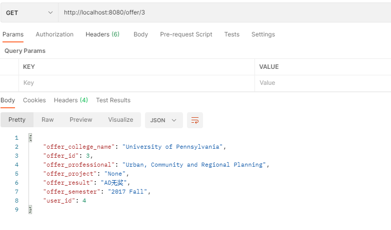
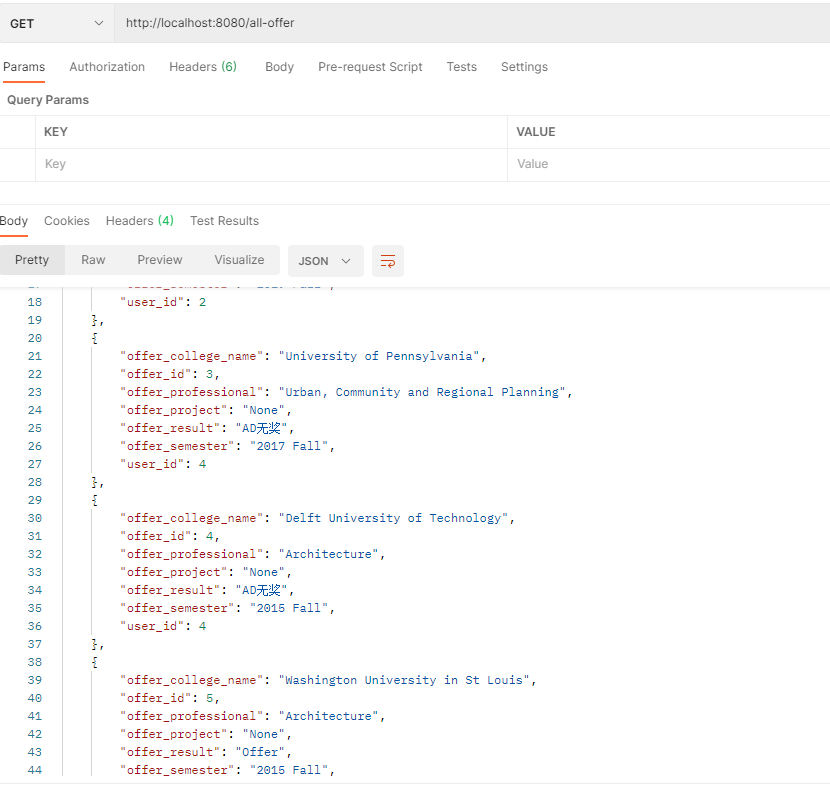
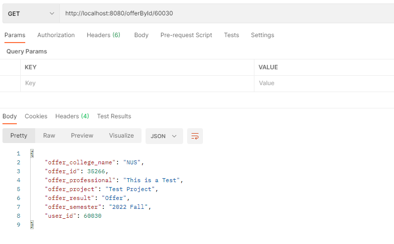
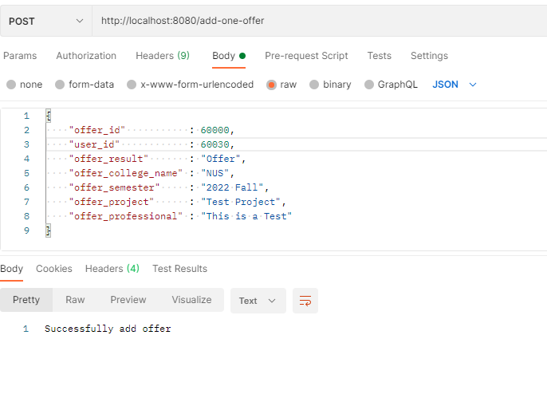

# Offer Sharing Platform

| Student ID | Student Name  |
|------------|---------------|
| A0228542E  | Liu Zhiqi     |
| A0228543A  | Zhong Xiaoxue |
| A0229930B  | Wei Zhiyu     |

## 1. Basic Introduction

Our application is a platform where users can share their background and offers received. 
Users can post the scores of their standardized test and past experiences, 
and search information of applicants of their ideal universities.

## 2. libraries

The libraries we used in this project are `Akka HTTP` and `Slick`. Because some libraries does not support `Scala 3`,
so we may use `Scala 2`.
```
val AkkaVersion = "2.6.18"
val AkkaHttpVersion = "10.2.8"
val slickVersion = "3.3.3"

libraryDependencies ++= Seq(
  "com.typesafe.akka" %% "akka-actor-typed" % AkkaVersion,
  "com.typesafe.akka" %% "akka-stream" % AkkaVersion,
  "com.typesafe.akka" %% "akka-http" % AkkaHttpVersion,
  "com.typesafe.akka" %% "akka-http-spray-json" % AkkaHttpVersion,
  "com.typesafe.slick" %% "slick" % slickVersion,
  "com.typesafe.slick" %% "slick-codegen" % slickVersion,
  "org.slf4j" % "slf4j-nop" % "1.7.36",
  "com.h2database" % "h2" % "2.1.210",
  "mysql" % "mysql-connector-java" % "8.0.25"
)
```

## 3.API

### 3.1 get specific offer by `offer_id`

By accessing the api `http://localhost:8080/offer/3`, we can get the offer information that its `offer_id` is `3`.



### 3.2 get all offer

By accessing the api `http://localhost:8080/all-offer`, we can get all of the offer that we have.


### get specific offer by `user_id`

By accessing the api `http://localhost:8080/offerById/60020`, we can get the offer information that its `user_id` is `60020`.


### Add data

By accessing the api `http://localhost:8080/add-one-offer`, we can add data to the database. 
